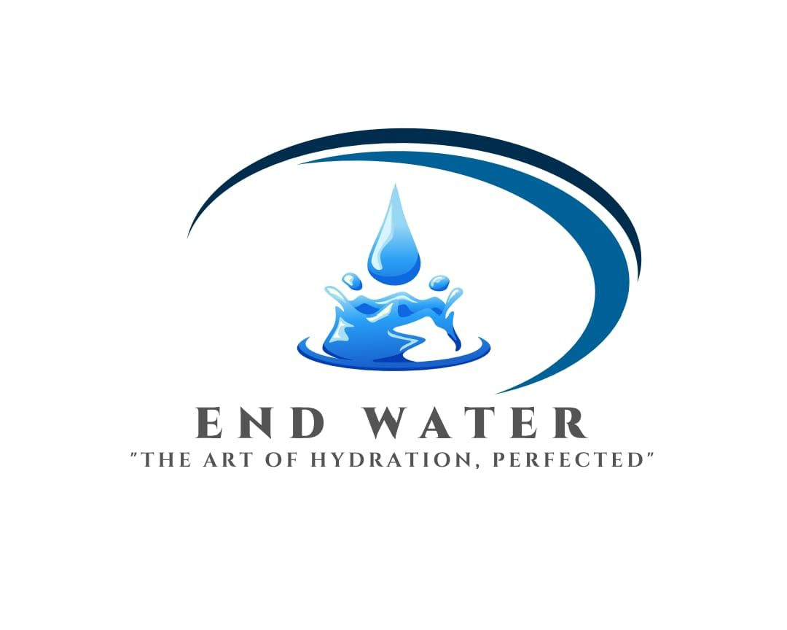

# 💧 END WATER - Premium Water Solutions

A modern, responsive e-commerce website for END WATER company, specializing in premium quality bottled water products.



## 🌊 About END WATER

END WATER is your trusted source for pure, clean, and refreshing bottled water. We offer premium quality water in various sizes to meet all your hydration needs.

### 📍 Location
**Address:** NO. 65, 4T1 STREET SHAYANDIMA, 0951  
**Phone:** 063 753 0316  
**Email:** ngohoramavhoya2@gmail.com  

## 🛍️ Products

- **500ml Still Water** - 24 bottles per pack - R108.00
- **1.5L Still Water** - 12 bottles per pack - R95.00  
- **5L Still Water** - 4 bottles per pack - R60.00
- **10L Still Water** - 4 bottles per pack - R90.00

## ✨ Website Features

- 📱 **Fully Responsive Design** - Works perfectly on desktop, tablet, and mobile
- 🛒 **Shopping Cart System** - Add products, manage quantities, view totals
- 📞 **WhatsApp Integration** - Direct ordering via WhatsApp
- 🎨 **Modern UI/UX** - Beautiful blue/black/white theme with animations
- 📧 **Contact Forms** - Multiple ways to get in touch
- 🗺️ **Google Maps Integration** - Find our location easily
- ⚡ **Fast Loading** - Optimized for performance

## 🚀 Technologies Used

- **HTML5** - Semantic markup and modern structure
- **CSS3** - Advanced styling with flexbox, grid, and animations
- **JavaScript** - Interactive functionality and cart management
- **Font Awesome** - Professional icons
- **Google Fonts** - Inter typography
- **Google Maps API** - Location integration

## 📱 Mobile Optimizations

- Touch-friendly buttons and navigation
- Responsive product grids
- Mobile-optimized cart experience
- WhatsApp deep linking for mobile devices
- Optimized images and loading times

## 🎨 Design Features

- **Glass Morphism Effects** - Modern translucent design elements
- **Gradient Backgrounds** - Beautiful blue-to-black gradients
- **Smooth Animations** - Fade-in effects and hover states
- **Professional Typography** - Clean, readable fonts
- **Consistent Branding** - END WATER colors and styling throughout

## 📞 Contact & Ordering

### WhatsApp Ordering
- Click any "Add to Cart" button
- Review your order in the cart
- Click "Checkout" to send order via WhatsApp
- Provide delivery address and contact details

### Direct Contact
- **Phone:** 063 753 0316
- **WhatsApp:** Direct messaging available
- **Email:** ngohoramavhoya2@gmail.com
- **Location:** Shayandima, Limpopo

## 🏗️ Development

### Local Development
```bash
# Serve locally
python -m http.server 8000
# Visit http://localhost:8000
```

### File Structure
```
ENDWATER/
├── index.html          # Main website page
├── script.js           # JavaScript functionality
├── styles.css          # CSS styling
├── images/             # Product and brand images
│   ├── endwater-logo.jpg
│   ├── 500ml-bottles.jpg
│   ├── 1.5liter-bottles.jpg
│   ├── 5liter-bottles.jpg
│   └── 10liter-bottles.jpg
├── README.md           # This file
├── LICENSE             # MIT License
└── .gitignore          # Git ignore rules
```

## 🌐 Deployment

This website is deployed using:
- **Domain:** Elite Host
- **Hosting:** Netlify
- **Version Control:** GitHub
- **SSL:** Automatic HTTPS via Netlify

## 👨‍💻 Developer

**Designed with ❤️ by Maanda Netshisumbewa**

## 📄 License

This project is licensed under the MIT License - see the [LICENSE](LICENSE) file for details.

## 🔮 Future Enhancements

- [ ] Payment gateway integration
- [ ] User accounts and order history
- [ ] Inventory management system
- [ ] Email newsletter signup
- [ ] Product reviews and ratings
- [ ] Multi-language support
- [ ] Advanced analytics integration

---

## 🚀 Quick Start

1. **Clone the repository**
   ```bash
   git clone https://github.com/yourusername/endwater-website.git
   ```

2. **Open in browser**
   ```bash
   cd endwater-website
   python -m http.server 8000
   ```

3. **Visit** http://localhost:8000

---

### 💧 Pure. Clean. Refreshing.

*Your trusted water solution provider*
